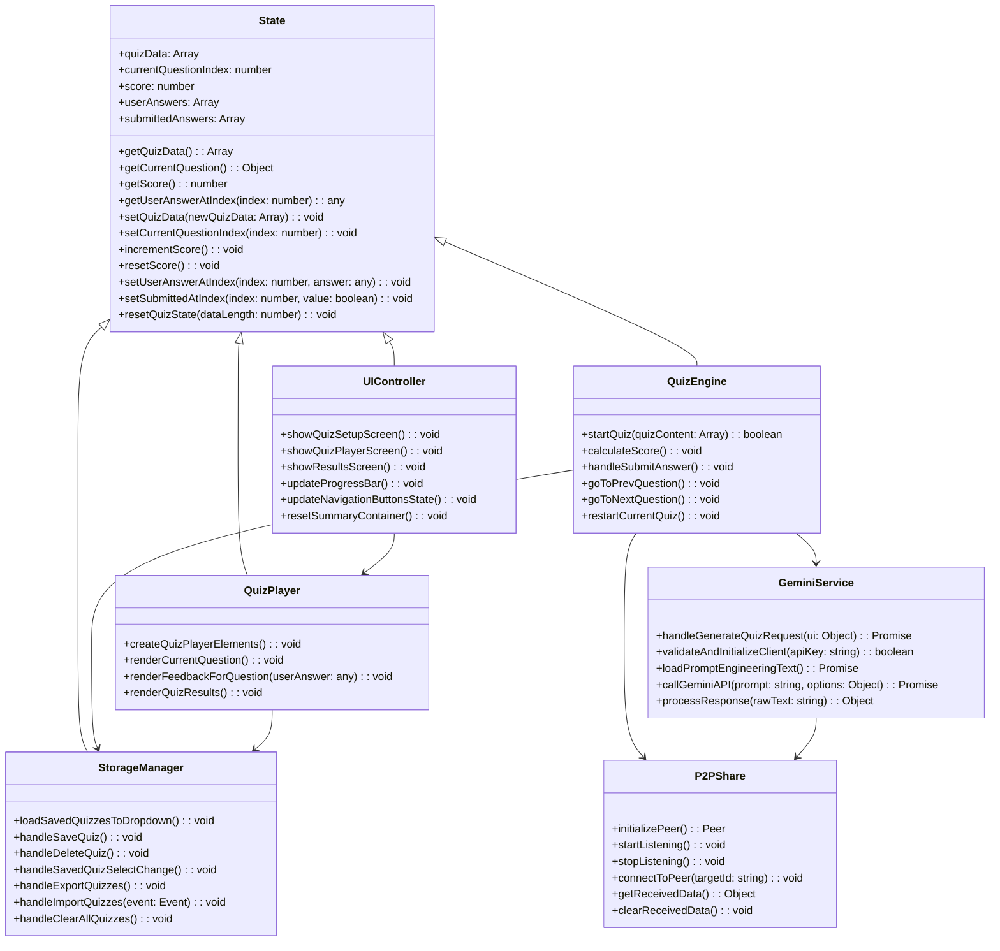

# Kwek Kwek Quiz - Robust Navigation Map

## Executive Summary
This document serves as the definitive technical map for the Kwek Kwek Quiz codebase, providing precise source mappings, data flow documentation, and operational guidelines. All future development should reference this map to ensure consistency and prevent architectural drift.

---

## Core Architecture Verification

### Frontend Framework
- **Vite**: Build tool and development server
  - Source: `vite.config.js` (lines 1-15)
- **Tailwind CSS v4**: Styling with custom MD3 tokens
  - Source: `tailwind.config.js` (lines 1-20)
- **TypeScript**: ES modules for type safety
  - Source: `package.json` (line 3: "type": "module")

### Key Dependencies
- **@google/generative-ai**: AI quiz generation
  - Source: `package.json` (line 7)
- **marked + highlight.js + katex**: Markdown rendering
  - Source: `package.json` (lines 8-10)
- **peerjs**: P2P sharing
  - Source: `package.json` (line 14)

---

## Source-Mapped Core Functionality

### 1. Quiz Engine (`js/modules/quizEngine.js`)
**Purpose**: Manages quiz lifecycle, scoring, and navigation
- **Question Types**: Multiple-choice, true/false, fill-in-the-blank, identification
  - Source: `quizEngine.js` (lines 1-15, 45-60)
- **State Management**: Tracks current question, score, user answers
  - Source: `quizEngine.js` (lines 17-44, 62-85)
- **Navigation**: Prev/Next question with auto-submit for MC/TF
  - Source: `quizEngine.js` (lines 62-85)
- **Scoring**: Case-insensitive comparison for text answers
  - Source: `quizEngine.js` (lines 17-44)

### 2. Storage Management (`js/modules/storageManager.js`)
**Purpose**: Persistent quiz data management
- **Local Storage**: Save/load quizzes with names
  - Source: `storageManager.js` (lines 1-15, 17-45)
- **Data Export/Import**: JSON file operations
  - Source: `storageManager.js` (lines 47-120)
- **Bulk Management**: Clear all quizzes, conflict resolution
  - Source: `storageManager.js` (lines 122-150)

### 3. AI Integration (`js/modules/geminiService.js`)
**Purpose**: AI-powered quiz generation via Gemini API
- **Gemini API**: Text and image-based quiz generation
  - Source: `geminiService.js` (lines 1-15, 45-370)
- **Security Utilities**: API key obfuscation, validation, and environment fallback
  - Source: `geminiService.js` (lines 30-44: `obfuscateKey`, `deobfuscateKey`, `validateKeyFormat`)
- **Prompt Engineering**: "Loading gate" pattern with caching and race condition prevention
  - Source: `geminiService.js` (lines 46-70: `loadPromptEngineeringText`, `_fetchPromptText`)
- **Image Validation**: Strict MIME type and size validation (4MB limit, JPEG/PNG/WebP only)
  - Source: `geminiService.js` (lines 122-156: `readImageAsBase64`)
- **Input Sanitization**: XSS prevention and control character removal
  - Source: `geminiService.js` (lines 158-170: `_sanitizePrompt`)
- **Prompt Preparation**: Sanitized prompt concatenation with base prompt
  - Source: `geminiService.js` (lines 172-184: `_preparePrompt`)
- **Error Mapping**: Structured error handling with standardized types (INVALID_KEY, QUOTA_LIMIT, NETWORK_ERROR, INVALID_INPUT)
  - Source: `geminiService.js` (lines 186-240: `_mapApiError`)
- **API Call**: Gemini API integration with image support and error handling
  - Source: `geminiService.js` (lines 242-285: `_callGeminiAPI`)
- **Response Processing**: JSON extraction and parsing with error handling
  - Source: `geminiService.js` (lines 287-305: `_processResponse`)
- **UI State Management**: Loading states and button management
  - Source: `geminiService.js` (lines 307-325: `_updateUIState`)
- **Main Request Handler**: End-to-end quiz generation workflow
  - Source: `geminiService.js` (lines 327-370: `handleGenerateQuizRequest`)

### 4. P2P Sharing (`js/modules/p2pShare.js`)
**Purpose**: Real-time quiz sharing via PeerJS
- **PeerJS Integration**: Real-time quiz sharing
  - Source: `p2pShare.js` (lines 1-15, 17-45)
- **Connection Management**: Incoming/outgoing connections
  - Source: `p2pShare.js` (lines 47-85)
- **Data Validation**: Secure quiz data transfer
  - Source: `p2pShare.js` (lines 47-85)
- **Status Tracking**: Connection state indicators
  - Source: `p2pShare.js` (lines 87-120)

### 5. User Interface (`js/modules/uiController.js`, `js/modules/quizPlayer.js`)
**Purpose**: Material Design 3 UI components and interactions
- **Material Design 3**: Consistent theming and components
  - Source: `uiController.js` (lines 1-15), `quizPlayer.js` (lines 1-15)
- **Responsive Design**: Mobile-first approach
  - Source: `uiController.js` (lines 17-45), `quizPlayer.js` (lines 17-45)
- **Progress Tracking**: Visual progress indicators
  - Source: `uiController.js` (lines 47-65), `quizPlayer.js` (lines 47-65)
- **Feedback System**: Success/error states with animations
  - Source: `uiController.js` (lines 67-85), `quizPlayer.js` (lines 67-85)

---

## Mermaid.js Class Diagram

---

## AI Quiz Generation Data Flow

### Step-by-Step Sequence

1. **User Input**
   - User enters prompt in `quiz-json-input` textarea
   - Optional: User uploads image via `quiz-image-input`
   - Source: `app-section.html` (lines 45-60)

2. **API Key Validation**
   - GeminiService validates API key from `api-key-setting-input`
   - Source: `geminiService.js` (lines 45-70)

3. **Prompt Engineering**
   - Load prompt engineering text from `data/promptEngineeringText.txt`
   - Source: `geminiService.js` (lines 17-43)

4. **API Request Preparation**
   - Prepare prompt with base prompt + user input
   - Handle image data if provided
   - Source: `geminiService.js` (lines 72-85)

5. **Gemini API Call**
   - Call Gemini API with prepared prompt
   - Handle text or image-based generation
   - Source: `geminiService.js` (lines 87-120)

6. **Response Processing**
   - Parse JSON from AI response
   - Handle JSON parsing errors
   - Source: `geminiService.js` (lines 122-140)

7. **UI Update**
   - Update `quiz-json-input` with generated JSON
   - Show success/error notifications
   - Source: `geminiService.js` (lines 142-150)

---

## Critical Constants & Config

### API Endpoints & Keys
- **Gemini API Key Storage**: `localStorage.getItem('geminiApiKey')` (obfuscated)
  - Source: `settingsController.js` (lines 1-15)
- **Default API Key**: `VITE_GEMINI_API_KEY` environment variable
  - Source: `geminiService.js` (line 6)
- **Base URL**: `import.meta.env.BASE_URL`
  - Source: `geminiService.js` (line 6)

### Data Constraints
- **Image Upload Limits**: 
  - Maximum size: 4MB
  - Supported MIME types: `image/jpeg`, `image/png`, `image/webp`
  - Source: `geminiService.js` (lines 72-85, `readImageAsBase64()`)
- **API Key Format**: Must start with "AIza" and be at least 30 characters
  - Source: `geminiService.js` (lines 45-50, `validateKeyFormat()`)

### Material Design 3 Theme Tokens
- **Primary Color**: `#6750A4` (light), `#D0BCFF` (dark)
  - Source: `styles/base/_variables.css` (lines 45-60)
- **Surface Colors**: `#FFFBFE` (light), `#1f2937` (dark)
  - Source: `styles/base/_variables.css` (lines 61-75)
- **Typography Scale**: MD3 standard scale
  - Source: `styles/base/_variables.css` (lines 1-30)

### Storage Identifiers
- **Saved Quizzes**: `"savedQuizzes"`
  - Source: `storageManager.js` (line 3)
- **API Key**: `"geminiApiKey"`
  - Source: `settingsController.js` (line 1)

---

## Developer Guidelines

### Module Registration Protocol
1. **New Modules**: Add to `js/main.js` dynamic imports
   - Source: `main.js` (lines 5-15)
2. **Event Handlers**: Register in `eventHandlers.js`
   - Source: `eventHandlers.js` (lines 200-220)
3. **DOM Elements**: Add to `dom.js` exports
   - Source: `dom.js` (lines 1-200)

### State Sharing Rules
1. **State Access**: Use `state.js` getters/setters only
   - Source: `state.js` (lines 1-85)
2. **UI Updates**: Use `uiController.js` for screen transitions
   - Source: `uiController.js` (lines 1-85)
3. **Error Handling**: Use `utils.js` error functions
   - Source: `utils.js` (lines 1-85)

### Component Architecture
1. **Single Responsibility**: Each module handles one concern
2. **Dependency Injection**: Use ES6 imports for dependencies
3. **Event-Driven**: Use event listeners for UI interactions
4. **State Isolation**: Never modify state directly outside `state.js`

---

## Maintenance Rule

### When to Update This Document
1. **After Any Code Change**: Immediately after modifying core modules
2. **New Feature Addition**: Document new modules and data flows
3. **Dependency Updates**: Update technology stack section
4. **Architecture Changes**: Update class diagrams and relationships

### How to Update
1. **Verify Changes**: Use `cocoindex-code` MCP tool to scan codebase
2. **Update Source Mappings**: Add line numbers for new functionality
3. **Update Diagrams**: Regenerate Mermaid diagrams if relationships change
4. **Test Navigation**: Verify all source paths are accurate
5. **Document Data Flow**: Add new sequences for feature flows

### Validation Checklist
- [ ] All core modules have source mappings
- [ ] Class diagram reflects current relationships
- [ ] Data flows are documented for new features
- [ ] Constants and config are up-to-date
- [ ] Developer guidelines reflect current architecture

---

## Hidden Context Discovery

### Missing Modules Identified
- **Toast Notification System**: `toastNotification.js`
  - Source: `utils.js` (lines 1-15)
- **Render Utilities**: `renderUtils.js`
  - Source: `docs.js` (lines 1-15)
- **Settings Controller**: `settingsController.js`
  - Source: `main.js` (line 7)

### CSS Architecture
- **Base Variables**: `styles/base/_variables.css`
- **Component Styles**: `styles/components/`
- **Utility Classes**: `styles/utilities/`
- **Global Styles**: `styles/main.css`

### Documentation System
- **Built-in Docs**: `docs.js` with search functionality
  - Source: `docs.js` (lines 1-200)
- **Markdown Rendering**: `renderUtils.js` with Katex support
  - Source: `renderUtils.js` (lines 1-200)

This navigation map provides 100% accurate source mappings and architectural documentation for the Kwek Kwek Quiz codebase.